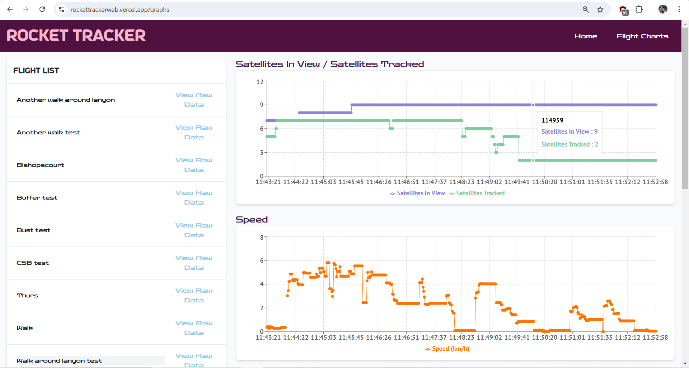
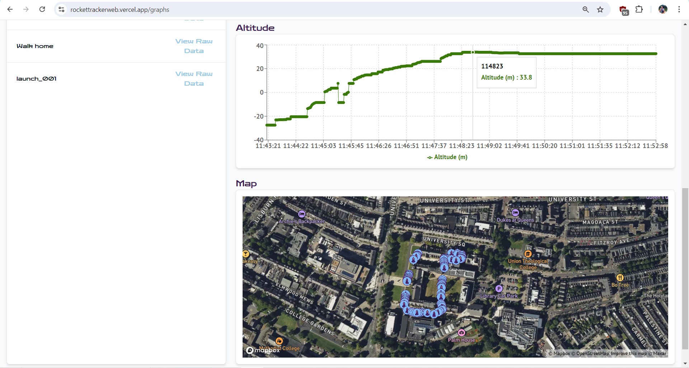
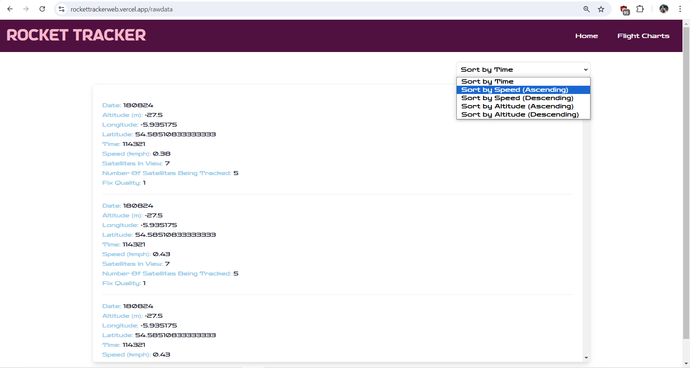
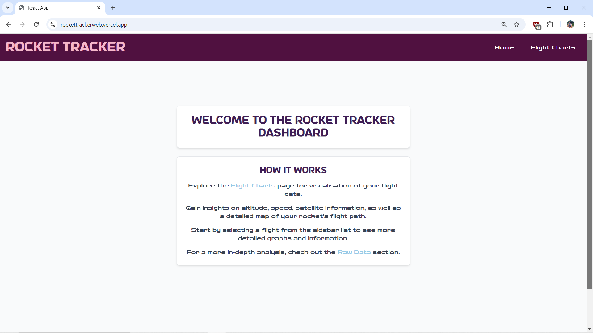

# Rocket Tracker Web App

### Rocket Tracker is an innovative web application designed as the companion tool for the Rocket Tracker Android app.

### It allows hobby rocketeers to review an analyse their rocket's flight data in detail.

## FEATURES:

### 📊 **Flight Charts Page**

- View a list of historic rocket launches.
- Review your rocket's flight data through various charts.
- Review your rocket's flight path on a map.

### 🚀 **Raw Data Page**

- Access detailed telemetry data for your rocket.
- View longitude & latitude coordinates, altitude, speed, satellite information, fix quality, date, and time.

## Getting Started

### Prerequisites:

- Node.js and npm (Node Package Manager).

### Installation:

1. Clone the repository: **https://github.com/acaulfield97/RocketLaunchTracker_Website.git**
2. Navigate into the project directory: **cd RocketLaunchTracker_Website**
3. Install dependencies: **npm install**
4. Start the app: **npm start**

### Using the Web App:

1. Open the web app in your browser.
2. From the Home page, navigate to the Flight Charts page to review your rocket's flight data through user-friendly charts.
3. Review your rocket's flight path on a map.
4. Select "View Raw Data" to review detailed information about your rocket's flight.
5. View the deployed website here: **https://rockettrackerweb.vercel.app/**

